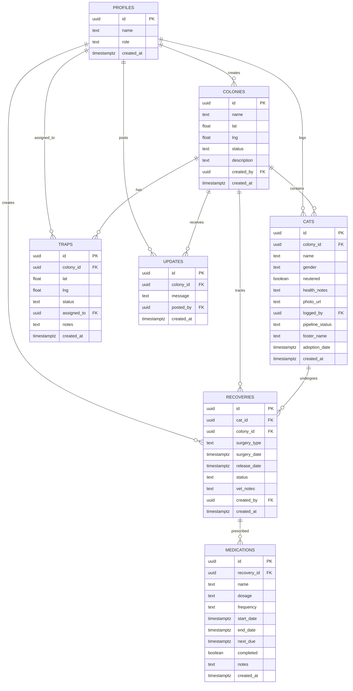

# 🗄️ TNR Tracker — Database Schema Documentation

## Overview

TNR Tracker uses **PostgreSQL** (hosted on Supabase) with **Row Level Security (RLS)** enabled on all tables. The schema is designed for relational integrity, audit traceability, and secure multi-tenant access.

All schema definitions are in [`supabase/schema.sql`](../supabase/schema.sql).

---

## Entity Relationship Diagram



---

## Table Definitions

### `profiles`
Extends Supabase's `auth.users` table with application-specific fields.

| Column | Type | Constraints | Description |
|--------|------|-------------|-------------|
| `id` | UUID | PK, FK → auth.users | User's auth ID |
| `name` | TEXT | NOT NULL, DEFAULT '' | Display name |
| `role` | TEXT | CHECK (admin, volunteer, feeder) | Access control role |
| `created_at` | TIMESTAMPTZ | DEFAULT NOW() | Registration timestamp |

### `colonies`
Represents a physical community cat colony location.

| Column | Type | Constraints | Description |
|--------|------|-------------|-------------|
| `id` | UUID | PK, DEFAULT gen_random_uuid() | Colony ID |
| `name` | TEXT | NOT NULL | Colony name |
| `lat` | DOUBLE PRECISION | CHECK (-90 to 90) | Latitude |
| `lng` | DOUBLE PRECISION | CHECK (-180 to 180) | Longitude |
| `status` | TEXT | CHECK (unmanaged, in_progress, managed) | Management status |
| `description` | TEXT | DEFAULT '' | Colony description |
| `created_by` | UUID | FK → profiles | Creator |
| `created_at` | TIMESTAMPTZ | DEFAULT NOW() | Creation timestamp |

### `cats`
Individual cat records within a colony.

| Column | Type | Constraints | Description |
|--------|------|-------------|-------------|
| `id` | UUID | PK | Cat ID |
| `colony_id` | UUID | FK → colonies, ON DELETE CASCADE | Parent colony |
| `name` | TEXT | DEFAULT '' | Cat name |
| `gender` | TEXT | CHECK (male, female, unknown) | Biological sex |
| `neutered` | BOOLEAN | NOT NULL, DEFAULT false | TNR status |
| `health_notes` | TEXT | DEFAULT '' | Veterinary notes |
| `photo_url` | TEXT | DEFAULT '' | Supabase Storage URL |
| `logged_by` | UUID | FK → profiles | Who logged the cat |
| `pipeline_status` | TEXT | CHECK (tnr, socializing, adoption_ready, adopted) | Adoption pipeline stage |
| `foster_name` | TEXT | DEFAULT '' | Foster parent name |
| `adoption_date` | TIMESTAMPTZ | nullable | Date of adoption |
| `created_at` | TIMESTAMPTZ | DEFAULT NOW() | Creation timestamp |

### `traps`
Trap locations deployed near colonies.

| Column | Type | Constraints | Description |
|--------|------|-------------|-------------|
| `id` | UUID | PK | Trap ID |
| `colony_id` | UUID | FK → colonies, ON DELETE CASCADE | Associated colony |
| `lat` | DOUBLE PRECISION | CHECK (-90 to 90) | Latitude |
| `lng` | DOUBLE PRECISION | CHECK (-180 to 180) | Longitude |
| `status` | TEXT | CHECK (available, in_use, needs_pickup) | Trap status |
| `assigned_to` | UUID | FK → profiles | Assigned volunteer |
| `notes` | TEXT | DEFAULT '' | Additional notes |
| `created_at` | TIMESTAMPTZ | DEFAULT NOW() | Creation timestamp |

### `updates`
Colony activity feed entries.

| Column | Type | Constraints | Description |
|--------|------|-------------|-------------|
| `id` | UUID | PK | Update ID |
| `colony_id` | UUID | FK → colonies, ON DELETE CASCADE | Associated colony |
| `message` | TEXT | NOT NULL, CHECK (no HTML tags) | Update message |
| `posted_by` | UUID | FK → profiles | Author |
| `created_at` | TIMESTAMPTZ | DEFAULT NOW() | Post timestamp |

> **Security**: The `message` column has a CHECK constraint (`message !~ '<[^>]+>'`) that rejects any HTML tags at the database level, preventing XSS injection.

### `recoveries`
Post-surgery recovery tracking records.

| Column | Type | Constraints | Description |
|--------|------|-------------|-------------|
| `id` | UUID | PK | Recovery ID |
| `cat_id` | UUID | FK → cats, ON DELETE CASCADE | Patient |
| `colony_id` | UUID | FK → colonies, ON DELETE CASCADE | Colony |
| `surgery_type` | TEXT | CHECK (spay_neuter, medical, dental, other) | Surgery type |
| `surgery_date` | TIMESTAMPTZ | DEFAULT NOW() | Surgery date |
| `release_date` | TIMESTAMPTZ | nullable | Expected/actual release |
| `status` | TEXT | CHECK (recovering, released, complications) | Recovery status |
| `vet_notes` | TEXT | DEFAULT '' | Veterinary notes |
| `created_by` | UUID | FK → profiles | Creator |
| `created_at` | TIMESTAMPTZ | DEFAULT NOW() | Creation timestamp |

### `medications`
Medication schedules linked to recovery records.

| Column | Type | Constraints | Description |
|--------|------|-------------|-------------|
| `id` | UUID | PK | Medication ID |
| `recovery_id` | UUID | FK → recoveries, ON DELETE CASCADE | Parent recovery |
| `name` | TEXT | NOT NULL | Medication name |
| `dosage` | TEXT | DEFAULT '' | Dosage information |
| `frequency` | TEXT | DEFAULT 'daily' | Administration frequency |
| `start_date` | TIMESTAMPTZ | DEFAULT NOW() | Start date |
| `end_date` | TIMESTAMPTZ | nullable | End date |
| `next_due` | TIMESTAMPTZ | nullable | Next dose due |
| `completed` | BOOLEAN | DEFAULT false | Course completed? |
| `notes` | TEXT | DEFAULT '' | Additional notes |
| `created_at` | TIMESTAMPTZ | DEFAULT NOW() | Creation timestamp |

---

## Indexes

| Index | Table | Column(s) | Type | Purpose |
|-------|-------|-----------|------|---------|
| `idx_cats_colony_id` | cats | colony_id | B-tree | Fast colony-to-cats joins |
| `idx_traps_colony_id` | traps | colony_id | B-tree | Fast colony-to-traps joins |
| `idx_cats_pipeline` | cats | pipeline_status | B-tree | Adoption pipeline filtering |
| `idx_recoveries_cat_id` | recoveries | cat_id | B-tree | Recovery lookups by cat |
| `idx_colonies_gist_coords` | colonies | lat, lng | GiST | Spatial coordinate queries |

---

## Row Level Security (RLS) Policies

### Security Helper Functions

```sql
-- Checks if a user is an admin (bypasses RLS recursion)
CREATE FUNCTION check_user_is_admin(user_id UUID) 
  RETURNS BOOLEAN SECURITY DEFINER;

-- Gets a user's role (bypasses RLS recursion)
CREATE FUNCTION get_user_role(user_id UUID) 
  RETURNS TEXT SECURITY DEFINER;
```

### Policy Summary

| Table | Operation | Policy |
|-------|-----------|--------|
| profiles | SELECT | Own profile OR admin |
| profiles | INSERT | Own profile only |
| profiles | UPDATE | Own profile, role change blocked |
| colonies | SELECT | All authenticated users |
| colonies | INSERT/UPDATE/DELETE | Authenticated users |
| cats | SELECT | All authenticated users |
| cats | INSERT/UPDATE/DELETE | Authenticated users |
| traps | ALL | Authenticated users |
| updates | ALL | Authenticated users |
| recoveries | ALL | Authenticated users |
| medications | ALL | Authenticated users |

---

## Storage

### `cat-photos` Bucket
- **Access**: Public (read)
- **Upload**: Authenticated users only
- **Usage**: Cat profile photos uploaded via the Add Cat form
- **URL Format**: `https://<project>.supabase.co/storage/v1/object/public/cat-photos/<filename>`

---

## Database Triggers

### Auto Profile Creation
A trigger on `auth.users` automatically creates a corresponding `profiles` row when a new user signs up:

```sql
CREATE FUNCTION handle_new_user() RETURNS TRIGGER AS $$
BEGIN
  INSERT INTO public.profiles (id, name, role)
  VALUES (NEW.id, COALESCE(NEW.raw_user_meta_data->>'name', ''), 'volunteer');
  RETURN NEW;
END;
$$ LANGUAGE plpgsql SECURITY DEFINER;
```

This ensures every authenticated user has a profile record for RLS policies to reference.
